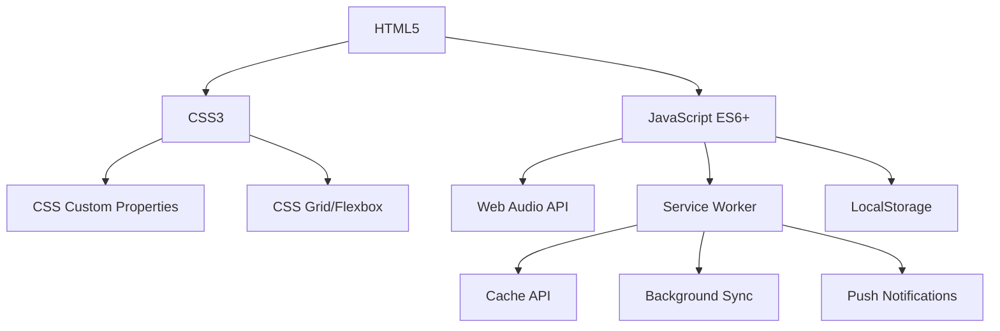

# 🔧 Technical Documentation - TASK QUEST

## 📋 Table of Contents

1. [Architecture Overview](#architecture-overview)
2. [Core Components](#core-components)
3. [PWA Implementation](#pwa-implementation)
4. [Performance Optimization](#performance-optimization)
5. [Audio System](#audio-system)
6. [Data Management](#data-management)
7. [Security Considerations](#security-considerations)
8. [Browser Compatibility](#browser-compatibility)
9. [Testing Strategy](#testing-strategy)
10. [Deployment Guide](#deployment-guide)

---

## 🏗️ Architecture Overview

### System Design

TASK QUEST follows a **client-side architecture** with the following key principles:

- **Progressive Enhancement**: Core functionality works without JavaScript
- **Offline-First**: Full functionality available without internet connection
- **Mobile-First**: Responsive design optimized for mobile devices
- **Performance-First**: Optimized for speed and efficiency

### Technology Stack



---

## 🧩 Core Components

### 1. TaskQuestGame Class

The main application class that orchestrates all game functionality:

```javascript
class TaskQuestGame {
  constructor() {
    // Initialize core systems
    this.quests = this.loadQuests();
    this.playerStats = this.loadPlayerStats();
    this.achievements = this.loadAchievements();
    
    // Initialize UI components
    this.initializeElements();
    this.bindEvents();
    
    // Initialize advanced features
    this.initializeTheme();
    this.initializeTime();
    this.initializeAlerts();
    this.initializePWAFeatures();
    
    // Start game loop
    this.render();
    this.updatePlayerStats();
    this.checkAchievements();
    this.startAlertChecker();
  }
}
```

### 2. Quest Management System

```javascript
// Quest data structure
const quest = {
  id: number,           // Unique identifier
  text: string,         // Quest description
  completed: boolean,   // Completion status
  priority: string,     // easy|medium|hard|boss
  category: string,     // work|personal|health|learning|shopping|general
  createdAt: string,    // ISO timestamp
  deadline: string,     // ISO timestamp (optional)
  xpValue: number       // XP reward amount
};

// XP calculation based on priority
const XP_VALUES = {
  'easy': 10,
  'medium': 25,
  'hard': 50,
  'boss': 100
};
```

### 3. Achievement System

```javascript
const achievements = {
  firstQuest: {
    title: 'First Quest',
    description: 'Complete your first quest',
    icon: '🎯',
    unlocked: false,
    condition: (game) => game.quests.filter(q => q.completed).length >= 1
  },
  questMaster: {
    title: 'Quest Master',
    description: 'Complete 10 quests',
    icon: '🏆',
    unlocked: false,
    condition: (game) => game.quests.filter(q => q.completed).length >= 10
  }
  // ... more achievements
};
```

---

## 📱 PWA Implementation

### Service Worker Architecture

```javascript
// Cache strategies
const CACHE_STRATEGIES = {
  STATIC: {
    strategy: 'cache-first',
    files: ['/', '/index.html', '/styles.css', '/script.js', '/manifest.json']
  },
  DYNAMIC: {
    strategy: 'network-first',
    patterns: [/^https:\/\/fonts\.googleapis\.com/]
  },
  NAVIGATION: {
    strategy: 'offline-fallback',
    fallback: '/index.html'
  }
};

// Service Worker lifecycle
self.addEventListener('install', handleInstall);
self.addEventListener('activate', handleActivate);
self.addEventListener('fetch', handleFetch);
self.addEventListener('sync', handleBackgroundSync);
self.addEventListener('push', handlePushNotification);
```

### App Manifest Configuration

```json
{
  "name": "TASK QUEST - Retro Todo Adventure",
  "short_name": "Task Quest",
  "display": "standalone",
  "orientation": "portrait-primary",
  "theme_color": "#667eea",
  "background_color": "#1a1a2e",
  "start_url": "/",
  "scope": "/",
  "icons": [
    {
      "src": "icons/icon-192x192.png",
      "sizes": "192x192",
      "type": "image/png",
      "purpose": "maskable any"
    }
  ],
  "shortcuts": [
    {
      "name": "Add New Quest",
      "url": "/?action=add",
      "icons": [{"src": "icons/shortcut-add.png", "sizes": "96x96"}]
    }
  ]
}
```

### Offline Functionality

```javascript
// Offline data management
class OfflineManager {
  constructor() {
    this.dbName = 'TaskQuestDB';
    this.version = 1;
    this.db = null;
  }
  
  async init() {
    return new Promise((resolve, reject) => {
      const request = indexedDB.open(this.dbName, this.version);
      
      request.onupgradeneeded = (event) => {
        const db = event.target.result;
        const store = db.createObjectStore('quests', { keyPath: 'id' });
        store.createIndex('completed', 'completed', { unique: false });
        store.createIndex('deadline', 'deadline', { unique: false });
      };
      
      request.onsuccess = (event) => {
        this.db = event.target.result;
        resolve(this.db);
      };
      
      request.onerror = () => reject(request.error);
    });
  }
  
  async saveQuest(quest) {
    const transaction = this.db.transaction(['quests'], 'readwrite');
    const store = transaction.objectStore('quests');
    return store.put(quest);
  }
  
  async getQuests() {
    const transaction = this.db.transaction(['quests'], 'readonly');
    const store = transaction.objectStore('quests');
    return new Promise((resolve, reject) => {
      const request = store.getAll();
      request.onsuccess = () => resolve(request.result);
      request.onerror = () => reject(request.error);
    });
  }
}
```

---

## ⚡ Performance Optimization

### 1. Critical Rendering Path

```javascript
// Optimized DOM manipulation
class DOMOptimizer {
  constructor() {
    this.updateQueue = [];
    this.isUpdating = false;
  }
  
  queueUpdate(updateFn) {
    this.updateQueue.push(updateFn);
    if (!this.isUpdating) {
      this.flushUpdates();
    }
  }
  
  flushUpdates() {
    this.isUpdating = true;
    requestAnimationFrame(() => {
      this.updateQueue.forEach(update => update());
      this.updateQueue = [];
      this.isUpdating = false;
    });
  }
}
```

### 2. Memory Management

```javascript
// Efficient event listener management
class EventManager {
  constructor() {
    this.listeners = new Map();
  }
  
  addListener(element, event, handler, options = {}) {
    const key = `${element.id || 'anonymous'}-${event}`;
    if (!this.listeners.has(key)) {
      this.listeners.set(key, []);
    }
    this.listeners.get(key).push(handler);
    element.addEventListener(event, handler, options);
  }
  
  removeAllListeners(element) {
    const elementId = element.id || 'anonymous';
    for (const [key, handlers] of this.listeners) {
      if (key.startsWith(elementId)) {
        handlers.forEach(handler => {
          element.removeEventListener(key.split('-')[1], handler);
        });
        this.listeners.delete(key);
      }
    }
  }
}
```

### 3. Lazy Loading

```javascript
// Lazy load non-critical resources
class LazyLoader {
  static loadFonts() {
    if ('fonts' in document) {
      document.fonts.ready.then(() => {
        document.body.classList.add('fonts-loaded');
      });
    }
  }
  
  static loadIcons() {
    const iconPromises = [];
    document.querySelectorAll('[data-icon]').forEach(element => {
      const iconUrl = element.dataset.icon;
      iconPromises.push(
        fetch(iconUrl)
          .then(response => response.blob())
          .then(blob => {
            element.src = URL.createObjectURL(blob);
          })
      );
    });
    return Promise.all(iconPromises);
  }
}
```

---

## 🔊 Audio System

### Web Audio API Implementation

```javascript
class AudioEngine {
  constructor() {
    this.audioContext = null;
    this.masterGain = null;
    this.soundEnabled = true;
    this.init();
  }
  
  async init() {
    try {
      this.audioContext = new (window.AudioContext || window.webkitAudioContext)();
      this.masterGain = this.audioContext.createGain();
      this.masterGain.connect(this.audioContext.destination);
      this.masterGain.gain.value = 0.1; // Master volume
    } catch (error) {
      console.warn('Audio not supported:', error);
      this.soundEnabled = false;
    }
  }
  
  playSound(soundType) {
    if (!this.soundEnabled || !this.audioContext) return;
    
    const soundConfig = this.getSoundConfig(soundType);
    this.synthesizeSound(soundConfig);
  }
  
  synthesizeSound(config) {
    const { frequencies, duration, type } = config;
    
    frequencies.forEach((freq, index) => {
      const oscillator = this.audioContext.createOscillator();
      const gainNode = this.audioContext.createGain();
      
      oscillator.connect(gainNode);
      gainNode.connect(this.masterGain);
      
      oscillator.frequency.setValueAtTime(freq, this.audioContext.currentTime);
      oscillator.type = this.getOscillatorType(type);
      
      // Envelope
      gainNode.gain.setValueAtTime(0, this.audioContext.currentTime);
      gainNode.gain.linearRampToValueAtTime(0.1, this.audioContext.currentTime + 0.01);
      gainNode.gain.exponentialRampToValueAtTime(0.001, this.audioContext.currentTime + duration);
      
      oscillator.start(this.audioContext.currentTime + index * 0.1);
      oscillator.stop(this.audioContext.currentTime + duration + index * 0.1);
    });
  }
  
  getSoundConfig(soundType) {
    const sounds = {
      'quest-completed': {
        frequencies: [400, 500, 600, 700],
        duration: 0.4,
        type: 'victory'
      },
      'level-up': {
        frequencies: [400, 500, 600, 700, 800],
        duration: 0.6,
        type: 'fanfare'
      },
      'achievement': {
        frequencies: [600, 700, 800, 900, 1000],
        duration: 0.8,
        type: 'celebration'
      }
    };
    return sounds[soundType] || { frequencies: [200], duration: 0.1, type: 'simple' };
  }
  
  getOscillatorType(type) {
    const types = {
      'victory': 'square',
      'fanfare': 'square',
      'celebration': 'square',
      'error': 'sawtooth',
      'simple': 'sine'
    };
    return types[type] || 'sine';
  }
}
```

---

## 💾 Data Management

### LocalStorage Strategy

```javascript
class DataManager {
  constructor() {
    this.storagePrefix = 'taskQuest_';
    this.compressionEnabled = true;
  }
  
  // Save data with compression
  save(key, data) {
    try {
      const serialized = JSON.stringify(data);
      const compressed = this.compressionEnabled ? 
        this.compress(serialized) : serialized;
      
      localStorage.setItem(this.storagePrefix + key, compressed);
      return true;
    } catch (error) {
      console.error('Save failed:', error);
      return false;
    }
  }
  
  // Load data with decompression
  load(key, defaultValue = null) {
    try {
      const stored = localStorage.getItem(this.storagePrefix + key);
      if (!stored) return defaultValue;
      
      const decompressed = this.compressionEnabled ? 
        this.decompress(stored) : stored;
      
      return JSON.parse(decompressed);
    } catch (error) {
      console.error('Load failed:', error);
      return defaultValue;
    }
  }
  
  // Simple compression using LZ-string
  compress(data) {
    if (typeof LZString !== 'undefined') {
      return LZString.compress(data);
    }
    return data; // Fallback to uncompressed
  }
  
  decompress(data) {
    if (typeof LZString !== 'undefined') {
      return LZString.decompress(data);
    }
    return data; // Fallback to uncompressed
  }
  
  // Export all data
  exportData() {
    const data = {};
    for (let i = 0; i < localStorage.length; i++) {
      const key = localStorage.key(i);
      if (key.startsWith(this.storagePrefix)) {
        const cleanKey = key.replace(this.storagePrefix, '');
        data[cleanKey] = this.load(cleanKey);
      }
    }
    return data;
  }
  
  // Import data
  importData(data) {
    Object.keys(data).forEach(key => {
      this.save(key, data[key]);
    });
  }
}
```

### Data Validation

```javascript
class DataValidator {
  static validateQuest(quest) {
    const schema = {
      id: { type: 'number', required: true },
      text: { type: 'string', required: true, maxLength: 500 },
      completed: { type: 'boolean', required: true },
      priority: { type: 'string', required: true, enum: ['easy', 'medium', 'hard', 'boss'] },
      category: { type: 'string', required: true, enum: ['work', 'personal', 'health', 'learning', 'shopping', 'general'] },
      createdAt: { type: 'string', required: true, format: 'iso-date' },
      deadline: { type: 'string', required: false, format: 'iso-date' },
      xpValue: { type: 'number', required: true, min: 0, max: 1000 }
    };
    
    return this.validateObject(quest, schema);
  }
  
  static validatePlayerStats(stats) {
    const schema = {
      level: { type: 'number', required: true, min: 1, max: 1000 },
      xp: { type: 'number', required: true, min: 0 },
      score: { type: 'number', required: true, min: 0 },
      streak: { type: 'number', required: true, min: 0 }
    };
    
    return this.validateObject(stats, schema);
  }
  
  static validateObject(obj, schema) {
    const errors = [];
    
    for (const [key, rules] of Object.entries(schema)) {
      const value = obj[key];
      
      // Check required fields
      if (rules.required && (value === undefined || value === null)) {
        errors.push(`${key} is required`);
        continue;
      }
      
      // Skip validation if value is undefined and not required
      if (value === undefined) continue;
      
      // Type validation
      if (rules.type && typeof value !== rules.type) {
        errors.push(`${key} must be of type ${rules.type}`);
      }
      
      // Enum validation
      if (rules.enum && !rules.enum.includes(value)) {
        errors.push(`${key} must be one of: ${rules.enum.join(', ')}`);
      }
      
      // Range validation
      if (rules.min !== undefined && value < rules.min) {
        errors.push(`${key} must be at least ${rules.min}`);
      }
      
      if (rules.max !== undefined && value > rules.max) {
        errors.push(`${key} must be at most ${rules.max}`);
      }
      
      // String length validation
      if (rules.maxLength && value.length > rules.maxLength) {
        errors.push(`${key} must be at most ${rules.maxLength} characters`);
      }
      
      // Format validation
      if (rules.format === 'iso-date' && !this.isValidISODate(value)) {
        errors.push(`${key} must be a valid ISO date string`);
      }
    }
    
    return {
      valid: errors.length === 0,
      errors
    };
  }
  
  static isValidISODate(dateString) {
    const date = new Date(dateString);
    return date instanceof Date && !isNaN(date) && dateString === date.toISOString();
  }
}
```

---

## 🔒 Security Considerations

### 1. XSS Prevention

```javascript
class SecurityManager {
  static escapeHtml(text) {
    const div = document.createElement('div');
    div.textContent = text;
    return div.innerHTML;
  }
  
  static sanitizeInput(input) {
    return input
      .trim()
      .replace(/[<>]/g, '') // Remove potential HTML tags
      .substring(0, 500); // Limit length
  }
  
  static validateUrl(url) {
    try {
      const parsed = new URL(url);
      return ['http:', 'https:'].includes(parsed.protocol);
    } catch {
      return false;
    }
  }
}
```

### 2. Content Security Policy

```html
<meta http-equiv="Content-Security-Policy" 
      content="default-src 'self'; 
               script-src 'self' 'unsafe-inline'; 
               style-src 'self' 'unsafe-inline' https://fonts.googleapis.com; 
               font-src 'self' https://fonts.gstatic.com; 
               img-src 'self' data:; 
               connect-src 'self';">
```

### 3. Data Privacy

```javascript
class PrivacyManager {
  static clearAllData() {
    // Clear localStorage
    Object.keys(localStorage).forEach(key => {
      if (key.startsWith('taskQuest_')) {
        localStorage.removeItem(key);
      }
    });
    
    // Clear IndexedDB
    if ('indexedDB' in window) {
      indexedDB.deleteDatabase('TaskQuestDB');
    }
    
    // Clear service worker cache
    if ('caches' in window) {
      caches.keys().then(cacheNames => {
        cacheNames.forEach(cacheName => {
          if (cacheName.startsWith('task-quest-')) {
            caches.delete(cacheName);
          }
        });
      });
    }
  }
  
  static exportUserData() {
    return {
      quests: this.getQuests(),
      playerStats: this.getPlayerStats(),
      achievements: this.getAchievements(),
      settings: this.getSettings(),
      exportDate: new Date().toISOString()
    };
  }
}
```

---

## 🌐 Browser Compatibility

### Feature Detection

```javascript
class CompatibilityChecker {
  static checkFeatures() {
    const features = {
      serviceWorker: 'serviceWorker' in navigator,
      webAudio: 'AudioContext' in window || 'webkitAudioContext' in window,
      localStorage: 'localStorage' in window,
      indexedDB: 'indexedDB' in window,
      pushNotifications: 'PushManager' in window,
      backgroundSync: 'serviceWorker' in navigator && 'sync' in window.ServiceWorkerRegistration.prototype,
      webAppManifest: 'onbeforeinstallprompt' in window
    };
    
    return features;
  }
  
  static getBrowserInfo() {
    const ua = navigator.userAgent;
    const browsers = {
      chrome: /Chrome/.test(ua) && /Google Inc/.test(navigator.vendor),
      firefox: /Firefox/.test(ua),
      safari: /Safari/.test(ua) && /Apple Computer/.test(navigator.vendor),
      edge: /Edg/.test(ua),
      opera: /Opera/.test(ua) || /OPR/.test(ua)
    };
    
    return Object.keys(browsers).find(browser => browsers[browser]) || 'unknown';
  }
  
  static getCapabilities() {
    const features = this.checkFeatures();
    const browser = this.getBrowserInfo();
    
    return {
      browser,
      features,
      pwaSupport: features.serviceWorker && features.webAppManifest,
      offlineSupport: features.serviceWorker && features.localStorage,
      audioSupport: features.webAudio,
      notificationsSupport: features.pushNotifications
    };
  }
}
```

### Polyfills

```javascript
// Service Worker polyfill for older browsers
if (!('serviceWorker' in navigator)) {
  console.warn('Service Worker not supported');
  // Fallback to basic functionality
}

// Web Audio API polyfill
if (!window.AudioContext && !window.webkitAudioContext) {
  console.warn('Web Audio API not supported');
  // Disable audio features
}

// LocalStorage polyfill
if (!window.localStorage) {
  console.warn('LocalStorage not supported');
  // Use memory storage as fallback
  window.localStorage = new MemoryStorage();
}
```

---

## 🧪 Testing Strategy

### Unit Testing

```javascript
// Test framework setup (using a simple test runner)
class TestRunner {
  constructor() {
    this.tests = [];
    this.results = [];
  }
  
  test(name, testFn) {
    this.tests.push({ name, testFn });
  }
  
  async run() {
    console.log('Running tests...');
    
    for (const test of this.tests) {
      try {
        await test.testFn();
        this.results.push({ name: test.name, status: 'PASS' });
        console.log(`✅ ${test.name}`);
      } catch (error) {
        this.results.push({ name: test.name, status: 'FAIL', error });
        console.error(`❌ ${test.name}:`, error.message);
      }
    }
    
    this.printSummary();
  }
  
  printSummary() {
    const passed = this.results.filter(r => r.status === 'PASS').length;
    const failed = this.results.filter(r => r.status === 'FAIL').length;
    
    console.log(`\nTest Summary: ${passed} passed, ${failed} failed`);
  }
}

// Example tests
const testRunner = new TestRunner();

testRunner.test('Quest creation', () => {
  const game = new TaskQuestGame();
  const initialCount = game.quests.length;
  
  game.addQuest('Test quest', 'medium', 'general');
  
  if (game.quests.length !== initialCount + 1) {
    throw new Error('Quest not added');
  }
  
  const newQuest = game.quests[0];
  if (newQuest.text !== 'Test quest') {
    throw new Error('Quest text incorrect');
  }
});

testRunner.test('XP calculation', () => {
  const game = new TaskQuestGame();
  const initialXP = game.playerStats.xp;
  
  game.addQuest('Test quest', 'boss', 'general');
  const quest = game.quests[0];
  game.toggleQuest(quest.id);
  
  if (game.playerStats.xp !== initialXP + 100) {
    throw new Error('XP calculation incorrect');
  }
});

// Run tests
testRunner.run();
```

### Integration Testing

```javascript
class IntegrationTester {
  static async testPWAFeatures() {
    const results = [];
    
    // Test service worker registration
    try {
      if ('serviceWorker' in navigator) {
        const registration = await navigator.serviceWorker.register('/sw.js');
        results.push({ test: 'Service Worker Registration', status: 'PASS' });
      } else {
        results.push({ test: 'Service Worker Registration', status: 'SKIP' });
      }
    } catch (error) {
      results.push({ test: 'Service Worker Registration', status: 'FAIL', error });
    }
    
    // Test localStorage
    try {
      localStorage.setItem('test', 'value');
      const value = localStorage.getItem('test');
      localStorage.removeItem('test');
      
      if (value === 'value') {
        results.push({ test: 'LocalStorage', status: 'PASS' });
      } else {
        results.push({ test: 'LocalStorage', status: 'FAIL' });
      }
    } catch (error) {
      results.push({ test: 'LocalStorage', status: 'FAIL', error });
    }
    
    // Test Web Audio API
    try {
      const audioContext = new (window.AudioContext || window.webkitAudioContext)();
      results.push({ test: 'Web Audio API', status: 'PASS' });
      audioContext.close();
    } catch (error) {
      results.push({ test: 'Web Audio API', status: 'FAIL', error });
    }
    
    return results;
  }
}
```

---

## 🚀 Deployment Guide

### 1. Pre-deployment Checklist

```bash
# 1. Test all features
npm run test

# 2. Check PWA requirements
lighthouse --only-categories=pwa

# 3. Validate manifest
web-app-manifest-validator manifest.json

# 4. Test offline functionality
# Disconnect internet and test app

# 5. Check performance
lighthouse --only-categories=performance
```

### 2. Build Process

```bash
# No build step required for vanilla JS
# Just ensure all files are optimized

# Optimize images (if any)
npx imagemin icons/*.png --out-dir=icons/optimized

# Minify CSS (optional)
npx clean-css-cli -o styles.min.css styles.css

# Minify JS (optional)
npx terser script.js -o script.min.js
```

### 3. Deployment Scripts

```bash
#!/bin/bash
# deploy.sh

echo "🚀 Deploying TASK QUEST..."

# 1. Backup current version
echo "📦 Creating backup..."
tar -czf backup-$(date +%Y%m%d-%H%M%S).tar.gz .

# 2. Validate files
echo "✅ Validating files..."
if [ ! -f "index.html" ]; then
  echo "❌ index.html not found"
  exit 1
fi

if [ ! -f "manifest.json" ]; then
  echo "❌ manifest.json not found"
  exit 1
fi

if [ ! -f "sw.js" ]; then
  echo "❌ sw.js not found"
  exit 1
fi

# 3. Upload to hosting service
echo "📤 Uploading files..."
# Add your deployment commands here

echo "✅ Deployment complete!"
```

### 4. Environment Configuration

```javascript
// config.js
const CONFIG = {
  development: {
    apiUrl: 'http://localhost:3000',
    debug: true,
    cacheVersion: 'dev-1.0.0'
  },
  production: {
    apiUrl: 'https://api.taskquest.app',
    debug: false,
    cacheVersion: 'prod-1.0.0'
  }
};

const environment = process.env.NODE_ENV || 'development';
export default CONFIG[environment];
```

---

## 📊 Monitoring & Analytics

### Performance Monitoring

```javascript
class PerformanceMonitor {
  constructor() {
    this.metrics = {};
    this.init();
  }
  
  init() {
    // Monitor Core Web Vitals
    this.observeLCP();
    this.observeFID();
    this.observeCLS();
    
    // Monitor custom metrics
    this.observeGameMetrics();
  }
  
  observeLCP() {
    new PerformanceObserver((list) => {
      const entries = list.getEntries();
      const lastEntry = entries[entries.length - 1];
      this.metrics.lcp = lastEntry.startTime;
    }).observe({ entryTypes: ['largest-contentful-paint'] });
  }
  
  observeFID() {
    new PerformanceObserver((list) => {
      const entries = list.getEntries();
      entries.forEach(entry => {
        this.metrics.fid = entry.processingStart - entry.startTime;
      });
    }).observe({ entryTypes: ['first-input'] });
  }
  
  observeCLS() {
    let clsValue = 0;
    new PerformanceObserver((list) => {
      const entries = list.getEntries();
      entries.forEach(entry => {
        if (!entry.hadRecentInput) {
          clsValue += entry.value;
        }
      });
      this.metrics.cls = clsValue;
    }).observe({ entryTypes: ['layout-shift'] });
  }
  
  observeGameMetrics() {
    // Monitor game-specific metrics
    const game = window.taskQuest;
    if (game) {
      setInterval(() => {
        this.metrics.questCount = game.quests.length;
        this.metrics.completedQuests = game.quests.filter(q => q.completed).length;
        this.metrics.playerLevel = game.playerStats.level;
      }, 30000); // Every 30 seconds
    }
  }
  
  getMetrics() {
    return { ...this.metrics };
  }
}
```

---

## 🔧 Troubleshooting

### Common Issues

1. **Service Worker Not Updating**
   ```javascript
   // Force service worker update
   if ('serviceWorker' in navigator) {
     navigator.serviceWorker.getRegistration().then(registration => {
       if (registration) {
         registration.update();
       }
     });
   }
   ```

2. **Audio Not Playing**
   ```javascript
   // Resume audio context on user interaction
   document.addEventListener('click', () => {
     if (audioContext.state === 'suspended') {
       audioContext.resume();
     }
   }, { once: true });
   ```

3. **LocalStorage Quota Exceeded**
   ```javascript
   // Check storage quota
   if ('storage' in navigator && 'estimate' in navigator.storage) {
     navigator.storage.estimate().then(estimate => {
       console.log('Storage quota:', estimate.quota);
       console.log('Storage usage:', estimate.usage);
     });
   }
   ```

### Debug Mode

```javascript
// Enable debug mode
window.TASK_QUEST_DEBUG = true;

if (window.TASK_QUEST_DEBUG) {
  // Expose game instance globally
  window.taskQuestDebug = {
    game: window.taskQuest,
    storage: new DataManager(),
    audio: new AudioEngine(),
    performance: new PerformanceMonitor()
  };
  
  console.log('🎮 TASK QUEST Debug Mode Enabled');
  console.log('Available: window.taskQuestDebug');
}
```

---

This technical documentation provides a comprehensive overview of the TASK QUEST architecture, implementation details, and best practices. It serves as a reference for developers, contributors, and anyone interested in understanding the technical aspects of this Progressive Web App.
